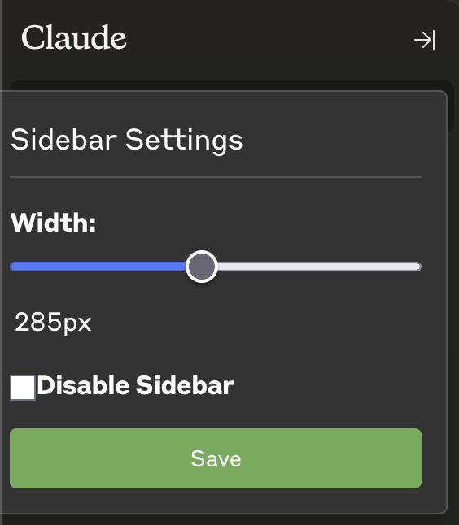

# 🤖 Claude.ai Sidebar Modifier

## 🎯 Description
This Firefox extension allows you to modify the sidebar behavior on Claude.ai. You can adjust the sidebar width or completely disable it from popping in. Useful for users who want to optimize their screen real estate or prefer a specific sidebar width.

## ✨ Features
- ➡️ Adjust sidebar width using a slider
- 🚫 Completely disable the sidebar
- 🔒 Can only access https://claude.ai/

## 🖼️ Images

| Extension Settings | Width Demo |
|:------------------:|:----------:|
|  |  |

## 🛠️ Installation
### From the Official Firefox Extension Gallery
1. Visit the [Claude Sidebar Modifier extension page](https://addons.mozilla.org/en-US/firefox/addon/claude-sidebar-modifier/).
2. Click on "Add to Firefox" and follow the prompts to install the extension.

### Manual Installation
1. Clone this repository or download the ZIP file.
2. Open Firefox and navigate to `about:debugging#/runtime/this-firefox`.
3. Click on "Load Temporary Add-on".
4. Select the `manifest.json` file from the project directory.

## 📁 Project Structure
```
claude-sidebar-mod/
├── manifest.json
├── sidebar-disable.js
├── background.js
├── sidebar-disable.css
├── popup.html
├── popup.js
└── assets/
    ├── icon-48.png
    ├── icon-96.png
    ├── extension-settings.png
    └── extension-width-demo.png
```

## 🔧 Usage
1. Visit a Claude.ai page.
2. Click on the extension icon in the Firefox toolbar to open the popup.
3. Use the slider to adjust the sidebar width.
4. Toggle the "Disable Sidebar" checkbox to enable or disable the sidebar.
5. Your settings will be automatically applied and saved.

## 👨‍💻 Development
To modify the extension:
1. Edit the relevant files (`sidebar-disable.js`, `popup.js`, `background.js`, etc.).
2. Reload the extension in Firefox (go to `about:debugging`, find the extension, and click "Reload").
3. Refresh the Claude.ai page to see your changes.

## 🐛 Troubleshooting
If you encounter any issues:
1. Ensure you're using the latest version of Firefox.
2. Try disabling and re-enabling the extension.
3. If problems persist, please open an issue in this repository with a detailed description of the problem.

## 📄 License
This project is licensed under the MIT License - see the [LICENSE](LICENSE) file for details.

---
⚠️ **Disclaimer**: This extension modifies functionality on Claude.ai. Use at your own risk.
